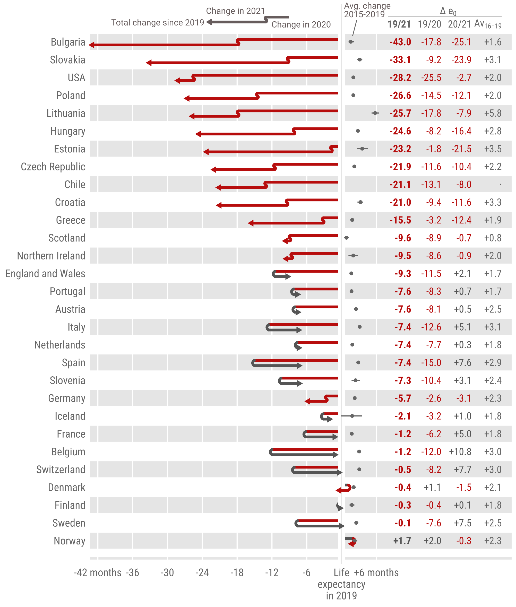

# Life expectancy changes since COVID-19


[](https://doi.org/10.5281/zenodo.6224983)
[](https://doi.org/10.5281/zenodo.6241024)
[](https://doi.org/10.5281/zenodo.6224375)



## Introduction

This is a repository to accompany 'Life expectancy changes since COVID-19', forthcoming in Nature Human Behavior. The replication files for this paper include customised functionality written in the [**R**](https://www.r-project.org/) statistical programming language.

## Prerequisites

As a pre-requisite to running this locally, you will need a working installation of [**R**](https://www.r-project.org/) with all of the necessary dependencies (see `./src/install_dependencies.R`).

## Running the Code

To run this code, do something like:

```console
git clone https://github.com/jschoeley/ex2021.git
```

and then execute each of the scripts in ascending numeric order which will undertake sequential tasks like downloading and harmonizing data, running life table simulations, and outputting tables and visualizations. Output files are tagged with the same numeric prefix as the source file generating the file.

## Structure

- `./cfg` configuration files
- `./dat` input source data
  - not synced, but download code provided, see https://github.com/jschoeley/ex2021/blob/main/out/README.md for the data sources
- `./doc` the paper draft
- `./out` output data, tables, figures
  - not synced, see https://doi.org/10.5281/zenodo.6241024 and https://doi.org/10.5281/zenodo.6224375 for analysis output
- `./src` code to replicate the data cleaning, analysis and visualisation
- `./tmp` temporary files generated during analysis
  - not synced, used when running the code
- `./ass` repository assets

### License

This work is free. You can redistribute it and/or modify it under the terms of the GNU Public license and subject to all prior terms and licenses imposed by the free, public data sources provided by the [HMD-STMF](https://mortality.org/Data/STMF), [CoverAge-DB](https://www.coverage-db.org/), [UK-ONS](https://www.ons.gov.uk/), and [US-CDC](https://www.cdc.gov/) (i.e. the 'data originators'). The code comes without any warranty, to the extent permitted by applicable law.
